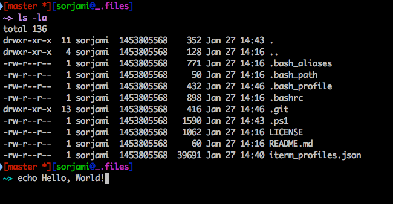

# .files
----
Keeping my dot files synchronized between devices.

## How it should look / feel
The idea is, that (when using iTerm2), command(s) are hilighted after executing them.   
This helps with browsing history   

